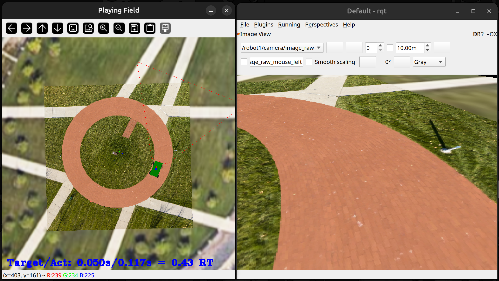

# LTU-Self-Drive-Sim

Gazelle Sim based package with LTU campus map for Self Drive Testing using ACTor. Also includes the image to steering angle conversion node which uses pre-trained model for image to steering angle prediction.

## Installation

Simply clone this repository into your ROS Noetic workshop. Then `catkin_make` and `source devel/setup.bash` to run launch files.

> This package requires Gazelle Sim based on ROS Noetic. See [GazelleSim](https://github.com/gderose2/gazelle_sim) for more details.

## Example Run

